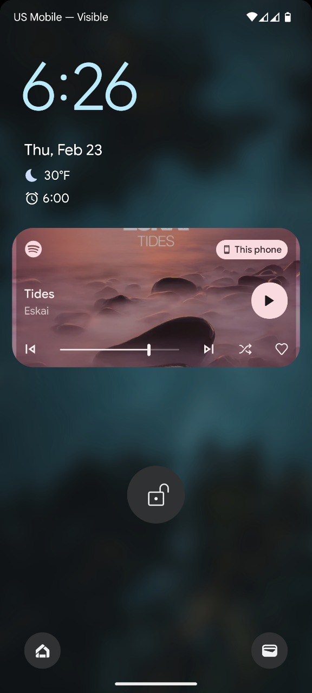
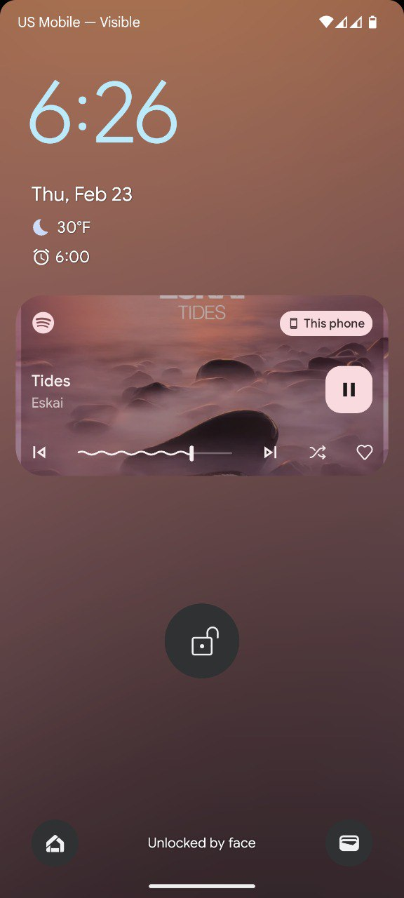

# It's back in vogue...
- Over the last couple months, I've noticed more and more projects popping up reimplementing this feature! Here are my favorites:
  
  * [Music Live Wallpaper](https://play.google.com/store/apps/details?id=com.lstapps.musiclivewallpaper&hl=en_US) is the perfect implementation of this, honestly better than Blurlocke. Support this developer, they deserve the world ❤️
  
  * Many [Evolution X](https://evolution-x.org) builds have reintroduced the "Media cover art" setting, a perfect replica of the Android 10 behavior. The blur level's even customizable!

# Blurlocke
- Android 10 used to have a feature where the currently-playing music [would have its art displayed zoomed and blurred as your lock screen wallpaper](https://www.androidpolice.com/album-art-wallpapers-should-never-have-been-removed-but-material-you-is-the-time-to-bring-it-back/).
- Google [removed this without warning](https://9to5google.com/2020/08/02/android-11-lockscreen-art) in a developer build of Android 11, leaving us in a world without album art lock screen...until now.

Normal lock screen         |  Blurlocke
:-------------------------:|:-------------------------:
  |  

## required
- [KLWP Pro](https://play.google.com/store/apps/details?id=org.kustom.wallpaper.pro&hl=en_US&gl=US)

## install
- Open KLWP and import the downloaded .klwp asset. Give KLWP access to notifications.
- Swipe over to ```Background```, tap ```Pick Image``` on the ```Bitmap``` row, and choose your wallpaper.
- Press the top-right save button and apply as both lock- and home-screen wallpaper.
